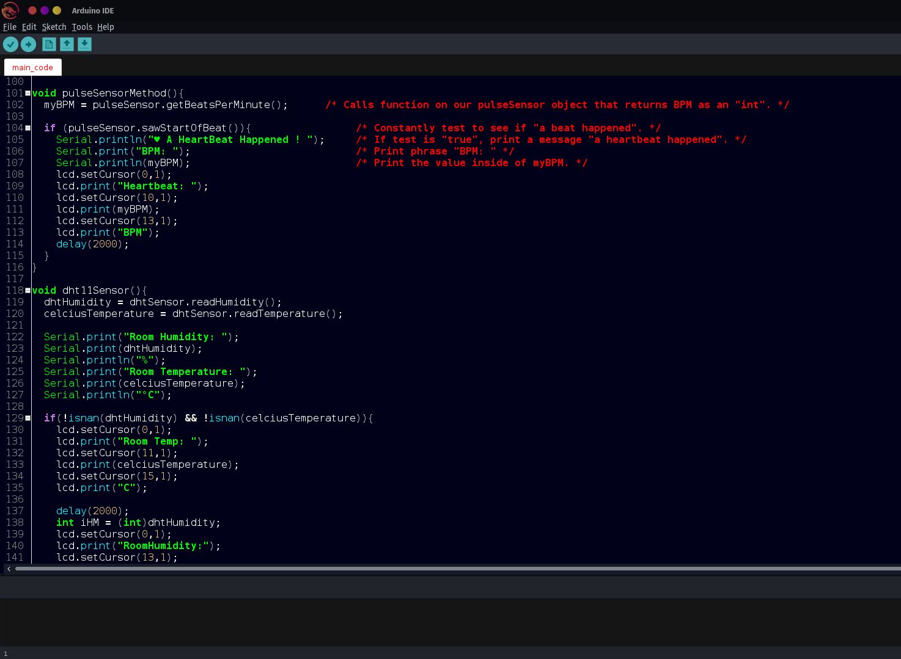

# Arduino Theme

---

---

Modern dark theme for the Arduino IDE.

### INSTALLATION  

* Mac users should look in `~/Applications/Arduino.app/Contents/Java/lib` and replace the `theme` folder inside (making a copy of the original in case want to revert back)  
* Windows is located in `C:\Program Files (x86)\Arduino\lib`  
* Linux will be in `/usr/share/arduino/lib/`

### CREATING YOUR OWN MODS

The newest version of the Arduino IDE makes creating custom themes trickier: you now need to edit the `theme.txt` file, an XML file inside the `syntax` folder, and the button files. Unfortunately, not all items in the `theme.txt` file actually work, so if you can't get an item to change, try another one of the files.
